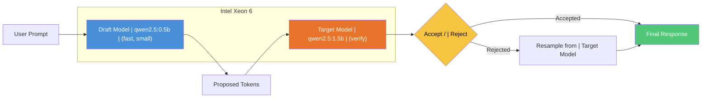
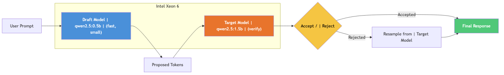

# Accelerate LLM inference with speculative decoding

Speed up text generation by pairing a fast draft model with a verification model, no accuracy loss.

## Table of Contents

- [Overview](#overview)
- [Who is this for](#who-is-this-for)
- [Example use cases](#example-use-cases)
- [Detailed description](#detailed-description)
  - [Architecture diagrams](#architecture-diagrams)
- [Requirements](#requirements)
  - [Minimum hardware requirements](#minimum-hardware-requirements)
  - [Minimum software requirements](#minimum-software-requirements)
  - [Required user permissions](#required-user-permissions)
- [Deploy](#deploy)
  - [Prerequisites](#prerequisites)
  - [Installation](#installation)
  - [Validating the deployment](#validating-the-deployment)
  - [Delete](#delete)
- [User interface](#user-interface)
- [Repository structure](#repository-structure)
- [References](#references)
- [Tags](#tags)

## Overview

Healthcare providers running AI inference on CPU infrastructure need faster response times without sacrificing output quality. This quickstart deploys speculative decoding on Intel Xeon 6 processors, pairing a fast draft model (qwen2.5:0.5b) with a larger target model (qwen2.5:1.5b). The draft model proposes tokens that the target model verifies in parallel, reducing end-to-end latency while producing identical output to running the target model alone. Teams can measure the speedup on their own hardware and compare vLLM native speculative decoding against app-layer draft model approaches. Both models are served locally via Ollama, requiring no external API keys.

## Who is this for

- **ML engineers optimizing inference latency** who need to benchmark speculative decoding on CPU-only infrastructure and quantify the speedup before deploying to production.
- **Platform architects evaluating speculative decoding** as a technique for reducing time-to-first-token and overall throughput on Intel Xeon hardware without adding GPUs.
- **Performance engineers benchmarking CPU inference** who want to compare app-layer draft-verify against vLLM native speculative decoding and measure token acceptance rates under realistic workloads.

## Example use cases

- **Accelerating clinical note summarization** -- Reduce the latency of summarizing long clinical notes by drafting candidate tokens with a small model and verifying them in a single pass through the target model, keeping output quality identical.
- **Faster code generation with draft-verify** -- Speed up code completion and generation workloads where the draft model can predict boilerplate tokens accurately, yielding high acceptance rates and lower end-to-end latency.
- **Real-time chatbot response optimization** -- Improve perceived responsiveness in customer-facing chatbot deployments by reducing token generation latency without resorting to model distillation or accuracy trade-offs.
- **Batch document processing speedup** -- Accelerate batch inference pipelines for document classification, extraction, or translation where per-request latency improvements compound across thousands of documents.

## Detailed description

Large language models generate text one token at a time, which makes inference latency proportional to output length. Speculative decoding breaks this bottleneck by running a small, fast draft model (qwen2.5:0.5b) to propose multiple tokens ahead, then verifying them in a single pass through the larger target model (qwen2.5:1.5b). Accepted tokens skip the expensive per-token generation step, delivering the same output quality at lower latency.

This quickstart packages a FastAPI service that benchmarks speculative decoding in two modes. In vLLM native mode, a dedicated vLLM pod runs with `--speculative-config` to handle draft and target model coordination at the engine level, using bfloat16 precision and prefix caching on Intel Xeon 6 CPUs. In app-layer mode, the service calls separate draft and target model endpoints through Ollama and compares their latencies directly. Both modes report measured speedup with a configurable claim threshold (default 1.5x) -- the service only labels the result as "faster" when the threshold is met. Token acceptance rate is tracked to quantify how many draft tokens the target model accepts.

A demo mode simulates the speculative decoding comparison without requiring real model endpoints, allowing development and testing on any machine. The service includes an AI disclaimer on all measurement responses: speedup numbers are environment-specific and should be validated on target hardware before publication.

### Architecture diagrams



**Speedup measurement:** The service runs baseline inference (target model only) and speculative inference (draft + verify) on the same prompt, then computes the wall-clock speedup ratio. The 0.5b draft model fits in the Intel Xeon 6 L3 cache, minimizing memory-fetch overhead during token proposal.



## Requirements

### Minimum hardware requirements

| Component | Specification |
|-----------|--------------|
| CPU | Intel Xeon 6 (Granite Rapids) with AMX support for bfloat16 |
| Memory | 24 GiB minimum (12 GiB for vLLM speculative pod + overhead) |
| Storage | 30 GiB available disk for model cache |
| L3 Cache | 350M draft model fits in L3 cache on Xeon 6 |

For demo mode (no real models required): any x86_64 system with 2 CPU cores and 4 GiB memory.

### Minimum software requirements

| Component | Version |
|-----------|---------|
| Red Hat OpenShift | 4.15+ |
| vLLM (CPU build) | 0.6+ |
| Helm | 3.12+ |
| oc CLI | 4.15+ |
| Podman (local dev) | 4.0+ |
| Ollama (local dev) | 0.3+ |

### Required user permissions

This quickstart can be deployed by a regular user with namespace-level permissions.

## Deploy

### Prerequisites

1. An OpenShift cluster running on Intel Xeon 6 nodes (or use demo mode for local development).
2. Helm 3.12+ and the `oc` CLI installed locally.
3. For live mode: Ollama or model endpoints accessible from the cluster.

For local development with Ollama (recommended):

```bash
podman --version   # 4.0+
docker compose version  # or podman-compose
```

### Installation

1. Clone the repository:

```bash
git clone https://github.com/rh-ai-quickstart/speculative-decoding-accelerator.git
cd speculative-decoding-accelerator
```

2. **Local development with Ollama (recommended):**

```bash
cp .env.example .env
docker compose up -d
# Ollama pulls qwen2.5:0.5b (draft) and qwen2.5:1.5b (target) automatically
curl http://localhost:8000/health
```

The docker-compose stack starts Ollama, pulls both models, and launches the FastAPI app with real model endpoints configured. No API keys required.

3. **Local development (demo mode):**

```bash
DEMO_MODE=true docker compose up -d app
curl http://localhost:8000/health
```

4. **OpenShift deployment:**

Create an OpenShift project:

```bash
oc new-project speculative-decoding-accelerator
```

Install using Helm:

**Option A: Demo mode (no real models)**

```bash
helm install speculative-decoding-accelerator chart/
```

**Option B: App-layer mode with separate model endpoints**

```bash
helm install speculative-decoding-accelerator chart/ \
  --set speculative.mode=app_layer \
  --set speculative.targetModelUrl=http://vllm-granite-2b:8000 \
  --set speculative.draftModelUrl=http://vllm-granite-350m:8000
```

**Option C: vLLM native speculative decoding**

```bash
helm install speculative-decoding-accelerator chart/ \
  --set speculative.mode=vllm_native \
  --set speculative.targetModelUrl=http://vllm-granite-2b:8000 \
  --set speculative.speculativeModelUrl=http://vllm-granite-2b-speculative:8000
```

### Validating the deployment

```bash
# Check pod status
oc get pods

# Get the application URL
echo "https://$(oc get route speculative-decoding-accelerator-app -o jsonpath='{.spec.host}')"

# Check health
curl -s https://$(oc get route speculative-decoding-accelerator-app -o jsonpath='{.spec.host}')/health | python3 -m json.tool

# Check speculative decoding status
curl -s https://$(oc get route speculative-decoding-accelerator-app -o jsonpath='{.spec.host}')/api/v1/speculative/status | python3 -m json.tool

# Run a speculative decoding comparison
curl -s -X POST https://$(oc get route speculative-decoding-accelerator-app -o jsonpath='{.spec.host}')/api/v1/speculative/run \
  -H "Content-Type: application/json" \
  -d '{"text": "Summarize the benefits of AI in healthcare.", "max_tokens": 128}' | python3 -m json.tool

# Run Helm test
helm test speculative-decoding-accelerator
```

### Delete

```bash
helm uninstall speculative-decoding-accelerator
oc delete project speculative-decoding-accelerator
```

## User interface

The Gradio UI is available at `http://localhost:7860` when running locally. It provides three tabs:

- **Speculative Decoding** -- Enter a prompt, click "Run Comparison", and view side-by-side baseline vs speculative latency, speedup ratio, and token acceptance rate.
- **Configuration** -- Inspect current draft and target model settings, claim threshold, and operating mode.
- **Statistics** -- View aggregate runtime metrics including request count, average latency, average speedup, and average acceptance rate.


## Repository structure

```
.
├── .env.example              # Environment variable template
├── .github/
│   └── workflows/
│       └── ci.yml            # CI pipeline: tests, README validation, compose check
├── chart/                    # Helm chart for OpenShift deployment
│   ├── Chart.yaml
│   ├── values.yaml
│   └── templates/
│       ├── deployment.yaml   # App deployment with speculative config
│       ├── service.yaml
│       ├── route.yaml
│       └── test-model-access.yaml
├── contracts/                # API contracts
│   └── openapi/
│       └── speculative.yaml  # OpenAPI 3.1 spec
├── docs/
│   └── images/               # Architecture diagrams and screenshots
├── src/                      # Application source code
│   ├── speculative.py        # FastAPI speculative decoding service
│   ├── ui.py                 # Gradio UI (3-tab interface)
│   ├── Containerfile
│   └── requirements.txt
├── tests/                    # CDD -> TDD -> EDD validation
│   ├── contracts/            # Stage 0: Contract compliance
│   ├── unit/                 # Stage 2: Technique validation
│   ├── integration/          # Stage 3: End-to-end flow
│   ├── benchmarks/           # Stage 4: Performance validation
│   ├── publication/          # Stage 5: README quality
│   ├── claim_registry.yaml   # Factual claims with provenance
│   ├── validation_matrix.yaml
│   └── benchmark_rubric.yaml
├── docker-compose.yml        # Local dev stack with Ollama model serving
├── Makefile                  # Test targets: make test-all
├── LICENSE
└── README.md
```

## References

- [Leviathan et al., "Fast Inference from Transformers via Speculative Decoding" (2023)](https://arxiv.org/abs/2211.17192) -- The foundational paper introducing speculative decoding for autoregressive models.
- [vLLM Speculative Decoding Documentation](https://docs.vllm.ai/en/latest/features/spec_decode.html) -- Engine-level speculative decoding support in vLLM.
- [Intel Xeon 6 Processor Specifications](https://www.intel.com/content/www/us/en/products/details/processors/xeon/xeon6.html) -- L3 cache sizes and AMX capabilities relevant to draft model fitting.
- [Intel AMX (Advanced Matrix Extensions)](https://www.intel.com/content/www/us/en/products/docs/accelerator-engines/advanced-matrix-extensions/overview.html) -- Hardware acceleration for bfloat16 matrix operations.
- [IBM Granite Models on Hugging Face](https://huggingface.co/ibm-granite)
- [Ollama Model Library](https://ollama.com/library) -- Pre-packaged models for local inference.
- [Red Hat OpenShift AI Documentation](https://docs.redhat.com/en/documentation/red_hat_openshift_ai_self-managed/)

## Tags

- **Title:** Accelerate LLM inference with speculative decoding
- **Description:** Speed up text generation by pairing a fast draft model with a verification model, no accuracy loss.
- **Industry:** Healthcare provider
- **Product:** Red Hat OpenShift AI
- **Use case:** AI inference
- **Partner:** Intel
- **Contributor org:** Red Hat
